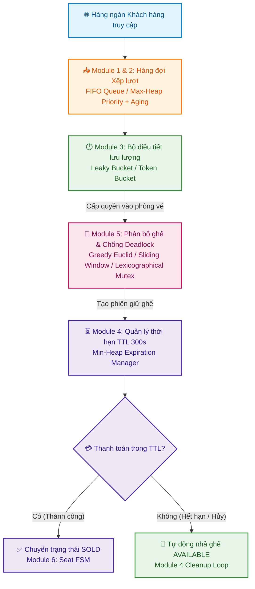
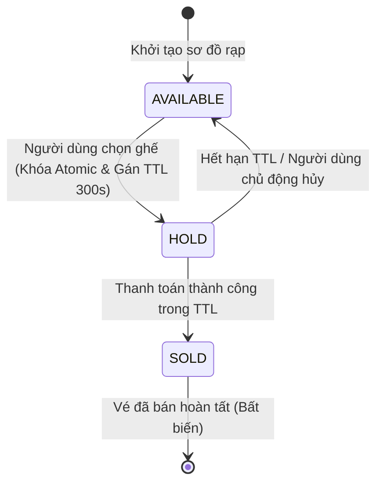

<div align="center">

# 🎟️ Virtual Waiting Room - High-Concurrency Ticketing System
### Hệ Thống Phòng Chờ Ảo Bán Vé Concert Quy Mô Lớn

[](https://www.python.org/)
[](#)
[](https://ut.edu.vn/)
[](#)
[](#)

<p align="center">
  <b>Giải pháp điều tiết lưu lượng đột biến (Traffic Spikes), xếp hàng công bằng, quản lý thời hạn giữ chỗ và kiểm soát tranh chấp ghế theo thời gian thực.</b>
</p>

[📌 Giới thiệu](#-1-giới-thiệu-tổng-quan-đề-tài) • 
[🏗️ Kiến trúc](#️-2-kiến-trúc-luồng-xử-lý-toàn-hệ-thống) • 
[⚡ Phân tích giải thuật](#-3-phân-tích-giải-thuật--độ-phức-tạp-các-module) • 
[👥 Phân công](#-4-bảng-phân-công-nhiệm-vụ-chi-tiết-8-thành-viên) • 
[🚀 Chạy thử nghiệm](#-6-hướng-dẫn-cài-đặt--chạy-thử-nghiệm)

---

</div>

## 📑 Mục lục
- [1. Giới thiệu tổng quan đề tài](#-1-giới-thiệu-tổng-quan-đề-tài)
- [2. Kiến trúc luồng xử lý toàn hệ thống](#️-2-kiến-trúc-luồng-xử-lý-toàn-hệ-thống)
- [3. Phân tích giải thuật & Độ phức tạp các Module](#-3-phân-tích-giải-thuật--độ-phức-tạp-các-module)
  - [3.1. Module 1: Hàng đợi FIFO](#31-module-1-hàng-đợi-fifo-first-in-first-out)
  - [3.2. Module 2: Hàng đợi ưu tiên & Cơ chế Aging](#32-module-2-hàng-đợi-ưu-tiên--cơ-chế-aging-max-heap)
  - [3.3. Module 3: Điều tiết lưu lượng](#33-module-3-điều-tiết-lưu-lượng-rate-limiting)
  - [3.4. Module 4: Quản lý thời hạn giữ ghế](#34-module-4-quản-lý-thời-hạn-giữ-ghế-ttl-manager)
  - [3.5. Module 5: Xử lý tranh chấp & Phân bổ ghế tối ưu](#35-module-5-xử-lý-tranh-chấp--phân-bổ-ghế-tối-ưu)
  - [3.6. Module 6: Quản lý vòng đời trạng thái ghế](#36-module-6-quản-lý-vòng-đời-trạng-thái-ghế-fsm)
  - [3.7. Module 7: Sinh dữ liệu & Benchmark hiệu năng](#37-module-7-sinh-dữ-liệu--benchmark-hiệu-năng)
  - [3.8. Module 8: Bộ mô phỏng sự kiện & Giao diện tương tác](#38-module-8-bộ-mô-phỏng-sự-kiện--giao-diện-trực-quan)
- [4. Bảng phân công nhiệm vụ chi tiết (8 Thành viên)](#-4-bảng-phân-công-nhiệm-vụ-chi-tiết-8-thành-viên)
- [5. Cấu trúc thư mục dự án](#-5-cấu-trúc-thư-mục-dự-án)
- [6. Hướng dẫn cài đặt & Chạy thử nghiệm](#-6-hướng-dẫn-cài-đặt--chạy-thử-nghiệm)
- [7. Bản quyền & Thông tin nhóm](#-7-bản-quyền--thông-tin-nhóm)

---

## 📌 1. Giới thiệu tổng quan đề tài

Trong các sự kiện âm nhạc quy mô lớn (Concert, Festival) hoặc các đợt mở bán vé có độ "nhiệt" cao (như *Taylor Swift Eras Tour, BlackPink, Anh Trai Say Hi*), hệ thống thường xuyên đối mặt với **hàng trăm ngàn tới hàng triệu lượt truy cập đồng thời** trong cùng một giây.

### 🛑 Thách thức kỹ thuật:
1. **Traffic Spike & Database Overload:** Lưu lượng đột biến làm sập máy chủ web và làm nghẽn kết nối Database.
2. **Race Condition & Double Booking:** Nhiều người dùng cùng bấm chọn 1 ghế tại cùng một millisecond, dẫn tới tình trạng bán trùng 1 ghế cho nhiều người.
3. **Deadlock nguy hiểm:** Khi người dùng mua nhiều ghế cùng lúc (Group Booking), các khóa tài nguyên lồng nhau dễ tạo vòng chờ vô tận (*Circular Wait*).
4. **Giữ chỗ ảo (Ghost Holds):** Người dùng giữ vé nhưng không thanh toán, nếu không có cơ chế thu hồi tự động sẽ gây lãng phí tài nguyên và mất doanh thu.
5. **Bất bình đẳng & Đói tài nguyên (Starvation):** Người dùng đến trước bị đẩy về sau hoặc người dùng thường không bao giờ được phục vụ do các request VIP liên tục chiếm quyền.

### 💡 Giải pháp Virtual Waiting Room:
Hệ thống đóng vai trò là một **tầng đệm thông minh (Smart Buffering & Flow Control Layer)** nằm giữa Client và Cơ sở dữ liệu, áp dụng các cấu trúc dữ liệu và giải thuật tối ưu trong môn học **Phân tích & Thiết kế Giải thuật (PTTKGT)** để giải quyết trọn vẹn các thách thức trên.

---

## 🏗️ 2. Kiến trúc luồng xử lý toàn hệ thống



---

## ⚡ 3. Phân tích giải thuật & Độ phức tạp các Module

| Module | Tên Module | Giải thuật / Cấu trúc dữ liệu chính | Độ phức tạp thời gian | Tư tưởng giải thuật áp dụng |
| :---: | :--- | :--- | :---: | :--- |
| **M1** | Hàng đợi FIFO | `collections.deque` (Doubly Linked Queue) | $\mathcal{O}(1)$ | Thứ tự thời gian tuyến tính |
| **M2** | Hàng đợi ưu tiên | `Max-Heap` + Hệ số suy biến `Aging Rate` | $\mathcal{O}(\log N)$ | Ưu tiên động, chống Starvation |
| **M3** | Điều tiết lưu lượng | `Leaky Bucket` & `Token Bucket` | $\mathcal{O}(1)$ | Kiểm soát lưu lượng theo chu kỳ |
| **M4** | Quản lý thời hạn vé | `Min-Heap` (Priority Queue theo `TTL timestamp`) | $\mathcal{O}(\log H)$ | Quản lý sự kiện hết hạn sớm nhất |
| **M5.1** | Gợi ý ghế đơn | **Tham lam (Greedy Algorithm)** - Euclid Distance | $\mathcal{O}(S)$ | Tối ưu hóa cục bộ vị trí gần sân khấu |
| **M5.2** | Tìm cụm $k$ ghế liền kề | **Cửa sổ trượt (Sliding Window / DP)** | $\mathcal{O}(M)$ | Tối ưu hóa không gian con liên tục |
| **M5.3** | Mua đồng thời cụm $k$ ghế | **Sắp xếp chống Deadlock** + **Khóa phân rã (Fine-grained Lock)** | $\mathcal{O}(k \log k)$ | Phá vỡ *Circular Wait*, Chia để trị |
| **M6** | Quản lý trạng thái ghế | **Máy trạng thái hữu hạn (FSM)** | $\mathcal{O}(1)$ | Kiểm soát tính toàn vẹn dữ liệu |
| **M7** | Benchmark hiệu năng | Đánh giá thực nghiệm Execution Time / Throughput | $\mathcal{O}(N)$ | Phân tích thực nghiệm giải thuật |
| **M8** | Bộ mô phỏng & GUI | **Mô phỏng sự kiện rời rạc (DES)** + Streamlit | $\mathcal{O}(E \log E)$ | Điều phối hàng đợi sự kiện Min-Heap |

---

### 3.1. Module 1: Hàng đợi FIFO (First In, First Out)
* **File:** [`FIFO-queue.py`](file:///d:/UTH/UTH/Phân%20tích%20thiết%20kế%20giải%20thuật/project/PTTKGT_Virtual-Waiting-Room_K26/FIFO-queue.py)
* **Nguyên lý:** Sử dụng hàng đợi hai đầu (`collections.deque`) đảm bảo phục vụ người dùng theo nguyên tắc công bằng tuyệt đối: ai đến trước được phục vụ trước.
* **Đặc tính:** Thao tác thêm vào cuối (`enqueue`) và lấy ra ở đầu (`dequeue`) đều đạt hiệu năng tối ưu $\mathcal{O}(1)$.

### 3.2. Module 2: Hàng đợi ưu tiên & Cơ chế Aging (Max-Heap)
* **File:** [`hàng đợi ưu tiên-1.py`](file:///d:/UTH/UTH/Phân%20tích%20thiết%20kế%20giải%20thuật/project/PTTKGT_Virtual-Waiting-Room_K26/hàng%20đợi%20ưu%20tiên-1.py)
* **Nguyên lý:** Phân cấp hạng vé (VIP, Standard). Để tránh việc người dùng thường bị **đói tài nguyên (Starvation)** khi có liên tục người dùng VIP đến sau, thuật toán áp dụng cơ chế **Aging**:
$$\text{Effective\_Score} = \text{Base\_Priority} + (\Delta t \times \text{Aging\_Rate})$$
* **Đặc tính:** Điểm ưu tiên tăng dần theo thời gian chờ $\Delta t$, giúp người dùng thường cũng sẽ được phục vụ sau một khoảng thời gian chờ hợp lý.

### 3.3. Module 3: Điều tiết lưu lượng (Rate Limiting)
* **Mô hình:** So sánh và triển khai song song:
  * **Leaky Bucket:** Làm mịn dòng lưu lượng đầu ra với tốc độ cố định $r$ (phù hợp bảo vệ Database Backend).
  * **Token Bucket:** Cho phép xử lý các đợt bùng nổ lưu lượng ngắn (*burst traffic*) khi token tích lũy còn đủ.

### 3.4. Module 4: Quản lý thời hạn giữ ghế (TTL Manager)
* **File:** [`quản lý thời hạn giữ vé.py`](file:///d:/UTH/UTH/Phân%20tích%20thiết%20kế%20giải%20thuật/project/PTTKGT_Virtual-Waiting-Room_K26/quản%20lý%20thời%20hạn%20giữ%20vé.py)
* **Nguyên lý:** Khi người dùng chọn ghế, hệ thống cấp một phiên giữ chỗ trong $300$ giây (Time-To-Live). Sử dụng `Min-Heap` lưu các mốc thời gian hết hạn `(expiration_time, seat_id, user_id)`.
* **Đặc tính:** Đỉnh Heap luôn chứa ghế sẽ hết hạn sớm nhất. Thao tác quét giải phóng ghế hết hạn đạt $\mathcal{O}(\log H)$, tự động thu hồi ghế về kho mà không cần quét toàn bộ danh sách.

### 3.5. Module 5: Xử lý tranh chấp & Phân bổ ghế tối ưu
* **File:** [`xử lý tranh chấp mua ghế.py`](file:///d:/UTH/UTH/Phân%20tích%20thiết%20kế%20giải%20thuật/project/PTTKGT_Virtual-Waiting-Room_K26/xử%20lý%20tranh%20chấp%20mua%20ghế.py)

#### 🔹 A. Thuật toán Tham lam (Greedy Best-Fit Allocation)
* **Mục tiêu:** Tự động tìm ghế đơn còn trống có vị trí đẹp nhất (gần tâm sân khấu nhất).
* **Hàm mục tiêu:** 
$$f(s) = \sqrt{(\text{Row} - \text{Row}_{\text{stage}})^2 + (\text{Col} - \text{Col}_{\text{center}})^2}$$
* **Độ phức tạp:** $\mathcal{O}(S)$ với $S$ là tổng số ghế.

#### 🔹 B. Thuật toán Cửa sổ trượt / Quy hoạch động (Sliding Window / DP)
* **Mục tiêu:** Tìm cụm $k$ ghế liên tiếp nhau trong cùng một hàng có độ lệch so với tâm sân khấu nhỏ nhất.
* **Độ phức tạp:** $\mathcal{O}(M)$ với $M$ là số ghế trong hàng.

#### 🔹 C. Thuật toán Khóa phân rã & Sắp xếp chống Bế tắc (Deadlock Prevention)
* **Phân rã khóa (Fine-grained Mutex):** Mỗi chiếc ghế là một tài nguyên có `threading.Lock` độc lập. Hai giao dịch mua hai ghế khác nhau có thể thực thi song song đồng thời $\mathcal{O}(1)$.
* **Phòng chống Deadlock:** Khi mua $k$ ghế cùng lúc, hệ thống sắp xếp mã ghế theo thứ tự từ điển $\mathcal{O}(k \log k)$ trước khi `acquire()`. Điều này triệt tiêu hoàn toàn khả năng xảy ra *Circular Wait* (Chờ đợi vòng tròn).



---

## 👥 4. Bảng phân công nhiệm vụ chi tiết (8 Thành viên)

| STT | Thành viên phụ trách | Module đảm nhiệm | Thuật toán / Kỹ thuật chính | Sản phẩm bàn giao | Trạng thái |
| :---: | :--- | :--- | :--- | :--- | :---: |
| **1** | **Thành viên 1** | **M1: Hàng đợi FIFO** | `Queue`, `FIFO`, mô hình `M/M/c` | Code `FIFO-queue.py`, bộ test case, báo cáo độ phức tạp $\mathcal{O}(1)$ | <kbd>Đã hoàn thành</kbd> |
| **2** | **Thành viên 2** | **M2: Hàng đợi ưu tiên** | `Max-Heap`, `Priority Queue`, `Aging` | Code `hàng đợi ưu tiên-1.py`, so sánh thứ tự phục vụ vs FIFO | <kbd>Đã hoàn thành</kbd> |
| **3** | **Thành viên 3** | **M3: Điều tiết lưu lượng** | `Leaky Bucket`, `Token Bucket` | Module Traffic Control, bảng so sánh định lượng 2 thuật toán | <kbd>Đang tiến hành</kbd> |
| **4** | **Thành viên 4** | **M4: Quản lý TTL giữ vé** | `Min-Heap`, `TTL (Time-To-Live)` | Code `quản lý thời hạn giữ vé.py`, demo tự nhả ghế hết hạn | <kbd>Đã hoàn thành</kbd> |
| **5** | **Thành viên 5** | **M5: Xử lý tranh chấp ghế** | `Mutex Lock`, `Greedy`, `Sliding Window`, `Anti-Deadlock` | Code `xử lý tranh chấp mua ghế.py`, test đa luồng Concurrency | <kbd>Đã hoàn thành</kbd> |
| **6** | **Thành viên 6** | **M6: Quản lý trạng thái ghế** | `Finite State Machine (FSM)`, `State Transition` | Module Seat FSM, sơ đồ trạng thái, kiểm tra chuyển trạng thái hợp lệ | <kbd>Đang tiến hành</kbd> |
| **7** | **Thành viên 7** | **M7: Benchmark & Đo lường** | `Benchmarking Framework`, `Matplotlib`, `CSV Export` | Script sinh dữ liệu tải cao, biểu đồ Throughput, Latency, Memory | <kbd>Đang tiến hành</kbd> |
| **8** | **Thành viên 8** | **M8: Mô phỏng DES & UI** | `Discrete-Event Simulation`, `Event Queue`, `Streamlit` | Web App Dashboard tương tác, điều khiển kịch bản mô phỏng | <kbd>Đang tiến hành</kbd> |

---

## 💻 5. Cấu trúc thư mục dự án

```text
PTTKGT_Virtual-Waiting-Room_K26/
│
├── 📄 README.md                          # Tài liệu kỹ thuật tổng quan dự án & bảng phân công
│
├── 📦 FIFO-queue.py                      # Module 1: Hàng đợi FIFO chuẩn O(1)
├── 📦 hàng đợi ưu tiên-1.py              # Module 2: Priority Queue + Aging chống Starvation (Max-Heap)
├── 📦 quản lý thời hạn giữ vé.py        # Module 4: Quản lý TTL 300s tự giải phóng ghế (Min-Heap)
├── 📦 xử lý tranh chấp mua ghế.py       # Module 5: Concurrency Control & Giải thuật Greedy / DP / Anti-Deadlock
│
├── 📂 docs/                              # Tài liệu phân tích thiết kế, Slide thuyết trình
└── 📂 tests/                             # Bộ kiểm thử đơn vị (Unit Tests) và Benchmark
```

---

## 🚀 6. Hướng dẫn cài đặt & Chạy thử nghiệm

### 1️⃣ Yêu cầu môi trường
* Python phiên bản **3.8** trở lên.
* Không yêu cầu cài đặt thư viện bên thứ 3 cho các module lõi (sử dụng thư viện chuẩn `heapq`, `collections`, `threading`, `time`, `math`).

### 2️⃣ Clone mã nguồn về máy
```bash
git clone https://github.com/NguyenToan309/PTTKGT_Virtual-Waiting-Room_K26.git
cd PTTKGT_Virtual-Waiting-Room_K26
```

### 3️⃣ Thực thi kiểm thử các module

#### 🔹 Kiểm thử Module 1 (Hàng đợi FIFO):
```bash
python FIFO-queue.py
```
> **Kết quả kỳ vọng:** Các yêu cầu mua vé được cấp phát tuần tự đúng thứ tự đến; tự động báo hết vé khi vượt quá số lượng còn lại.

#### 🔹 Kiểm thử Module 2 (Hàng đợi ưu tiên & Cơ chế Aging):
```bash
python "hàng đợi ưu tiên-1.py"
```
> **Kết quả kỳ vọng:** So sánh rõ ràng thứ tự xử lý giữa mô hình FIFO truyền thống và mô hình Max-Heap có Aging.

#### 🔹 Kiểm thử Module 4 (Quản lý thời hạn giữ ghế TTL 300s):
```bash
python "quản lý thời hạn giữ vé.py"
```
> **Kết quả kỳ vọng:** Ghế được giữ tạm thời và sau khoảng thời gian cấu hình (ví dụ demo 5s), hệ thống tự động thu hồi ghế hết hạn về kho vé.

#### 🔹 Kiểm thử Module 5 (Xử lý tranh chấp đa luồng & Thuật toán phân bổ ghế):
```bash
python "xử lý tranh chấp mua ghế.py"
```
> **Kết quả kỳ vọng:**
> 1. Thuật toán Tham lam tìm ra ghế đơn gần tâm sân khấu nhất (`A_05`).
> 2. Quy hoạch động tìm ra cụm 3 ghế liền kề cân đối nhất (`['B_04', 'B_05', 'B_06']`).
> 3. Mô phỏng 10 luồng cùng tranh chấp mua 1 ghế: **Duy nhất 1 luồng thành công, 9 luồng bị từ chối**, đảm bảo không bán trùng ghế!

---

## 🏛️ 7. Bản quyền & Thông tin nhóm

* **Đồ án:** Phân tích và Thiết kế Giải thuật (PTTKGT)
* **Khóa:** K26 - Trường Đại học Giao thông Vận tải TP.HCM (UTH)
* **Giảng viên hướng dẫn:** Bộ môn Khoa học Máy tính / Công nghệ Thông tin - UTH
* **Bản quyền:** Mã nguồn được phát hành theo giấy phép [MIT License](LICENSE).

<div align="center">
  <sub>Xây dựng với ❤️ bởi Nhóm sinh viên K26 UTH - Đồ án PTTKGT</sub>
</div>